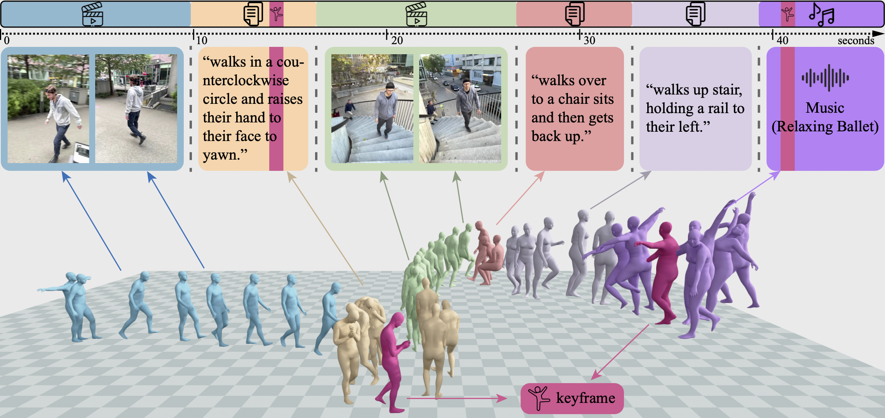

<p align="center">
 <h1 align="center"> GENMO: A Generalist Model for Human Motion</h1>
  <p align="center">
    <a href="https://jeffli.site/"><strong>Jiefeng Li</strong></a>
    ·
    <a href="https://www.jinkuncao.com/"><strong>Jinkun Cao</strong></a>
    ·
    <a href="https://cs.stanford.edu/~haotianz/"><strong>Haotian Zhang</strong></a>
    ·
    <a href="https://davrempe.github.io/"><strong>Davis Rempe</strong></a>
    ·
    <a href="https://jankautz.com/"><strong>Jan Kautz</strong></a>
    ·
    <a href="https://www.umariqbal.info/"><strong>Umar Iqbal</strong></a>
    ·
    <a href="https://ye-yuan.com/"><strong>Ye Yuan</strong></a>
  </p>
  <h2 align="center">ICCV 2025 (Highlight)</h2>
  <div align="center">
    
  </div>
</p>
<p align="center">
  <a href="https://research.nvidia.com/labs/dair/genmo/"></a>
  <a href="https://arxiv.org/abs/2505.01425"></a>

</p>

**GENMO** is a generalist model for human motion that handles multiple tasks with a single model, supporting diverse conditioning signals including video, keypoints, text, audio, and 3D keyframes.

---

## 📰 News

- **[October 2025]** 📢 The **GENMO** codebase is **released!**  
  Stay tuned for the pretrained models and evaluation scripts.  
  Follow the [project page](https://research.nvidia.com/labs/dair/genmo/) for updates and announcements.


---

## 🚀 Highlights

GENMO introduces a **unified generative framework** that connects motion estimation and generation through shared objectives.

- **Unified framework:** Reframes motion estimation as *constrained generation*, allowing a single model to perform both tasks.  
- **Regression × Diffusion synergy:** Combines the accuracy of regression models with the diversity of diffusion-based generation.  
- **Estimation-guided training:** Trains effectively on in-the-wild datasets using only 2D or textual supervision.  
- **Multimodal conditioning:** Supports video, text, audio, 2D/3D keyframes, or even time-varying mixed inputs (e.g., video → text → video).  
- **Arbitrary-length motion:** Generates continuous, coherent sequences of any duration in one diffusion pass.  
- **State-of-the-art performance:** Achieves leading results on diverse motion estimation and generation benchmarks.

For more details, visit the **[GENMO project page →](https://research.nvidia.com/labs/dair/genmo/)**

---

## 📖 Paper & Citation

**Paper:**  
[GENMO: Generative Models for Human Motion Synthesis](https://arxiv.org/abs/2505.01425)  
*Jiefeng Li, Jinkun Cao, Haotian Zhang, Davis Rempe, Jan Kautz, Umar Iqbal, Ye Yuan*  
ICCV, 2025

**BibTeX:**
```bibtex
@inproceedings{genmo2025,
  title     = {GENMO: Generative Models for Human Motion Synthesis},
  author    = {Li, Jiefeng and Cao, Jinkun and Zhang, Haotian and Rempe, Davis and Kautz, Jan and Iqbal, Umar and Yuan, Ye},
  booktitle = {Proceedings of the IEEE/CVF International Conference on Computer Vision (ICCV)},
  year      = {2025}
}
